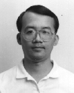

# 吳毅成（[English](.)、中文）

[國立交通大學資訊工程系][nctu_cs]教授  
[國際電腦對局學會][icga]副理事長  
[台灣電腦對局學會][tcga]理事長

---

### 相關網頁

- [六子棋首頁][connect6]
- 維基百科相關連結︰[吳毅成][icwu_wiki]、[六子棋][connect6_wiki]
- [臉書][icwu_facebook]

---

### [研究][research]

- 含主要研究方向及[成果][achievements]

### [著作][publications]

- 期刊論文、會議論文、專利、研發之系統

### [背景及經驗][about]

- 含教育背景、專業經驗、顧問經驗

### 摘錄榮譽事蹟（[完整][honors]、[新聞報導][news]）
- 2019：獲得 Amazon 舉辦的 AWS DeepRacer 台灣區第 1, 3, 5, 7 名, 第一名獲得進入 Las Vegas 世界賽
- 2018︰獲得科技部普適 AI 研究中心 (PAIR) 頒 "AI學術研究獎". 
- 2018︰獲科技部 (MOST) 未來科技獎. 
- 2018︰榮獲 TAAI 2018 會議之最佳論文獎
- 2017︰CGI 圍棋程式獲得中國野狐網站十段頭銜（繼絕藝、DeepZenGo 後全世界第三個 AI 獲得此頭銜）
- 2017︰獲得培生文教基金會和海峰棋院捐助 660 萬元
- 2017︰在中國內蒙古鄂爾多斯市舉辦的 [2017 中信證券杯首屆世界智能圍棋公開賽競賽](http://www.intergofed.org/igf-news-feed/2017-citic-securities-cup-the-1st-world-ai-go-open.html)，CGI 圍棋程式榮獲亞軍，並於首日預賽全勝，包括擊敗絕藝（騰訊公司所開發）、DeepZenGo，並獲得獎金 10 萬人民幣
- 2017︰在 IEEE FUZZ 2017 圍棋人機賽中，CGI 圍棋程式二戰二勝周俊勳九段（紅面棋王），第一次學界圍棋程式在人機圍棋正式賽中打敗職業九段
- 2017︰[第二十屆奧林匹亞電腦賽局競賽][icga]榮獲六金（Dark chess、Mahjong、Go 9x9、Go 13x13、Chinese chess、Einstein）、一銀（Go 19x19）、一銅（Othello）
- 2017︰圍棋人工智慧與物聯網大會人機配對賽（中韓台）冠軍 (詳見[此][honors])

### [開授課程][courses]

- 目前開授課程：網路程式設計、遊戲對局理論、深度學習與實務
- 過去曾開授課程：資料結構、程式語言、高等 Java 程式設計、演算法、系統程式、平行處理、平行分散程式設計、網際網路／企業內網路

### 實驗室

- [電腦遊戲與智慧實驗室][cgi_lab]

---

### 聯絡資訊

> 電話：035-731855  
> 傳真：035-733777  
> 電子郵件：<icwu@cs.nctu.edu.tw>  
> 地址：台灣新竹市國立交通大學資訊工程系大學路 1001 號

[news]: news.html
[about]: about.html
[honors]: honors.html
[courses]: courses.html
[research]: research.html
[publications]: publications.html
[achievements]: research.html#research-topics-and-achievements
[cgi_lab]: http://www.aigames.nctu.edu.tw/
[nctu]: https://www.nctu.edu.tw/
[nctu_cs]: https://www.cs.nctu.edu.tw/cswebsite/
[connect6]: http://www.connect6.org/
[connect6_wiki]: http://en.wikipedia.org/wiki/Connect6
[icwu_wiki]: http://en.wikipedia.org/wiki/I-Chen_Wu
[icwu_facebook]: https://www.facebook.com/icwu307
[icga]: https://icga.org/
[tcga]: http://tcga.ndhu.edu.tw/
