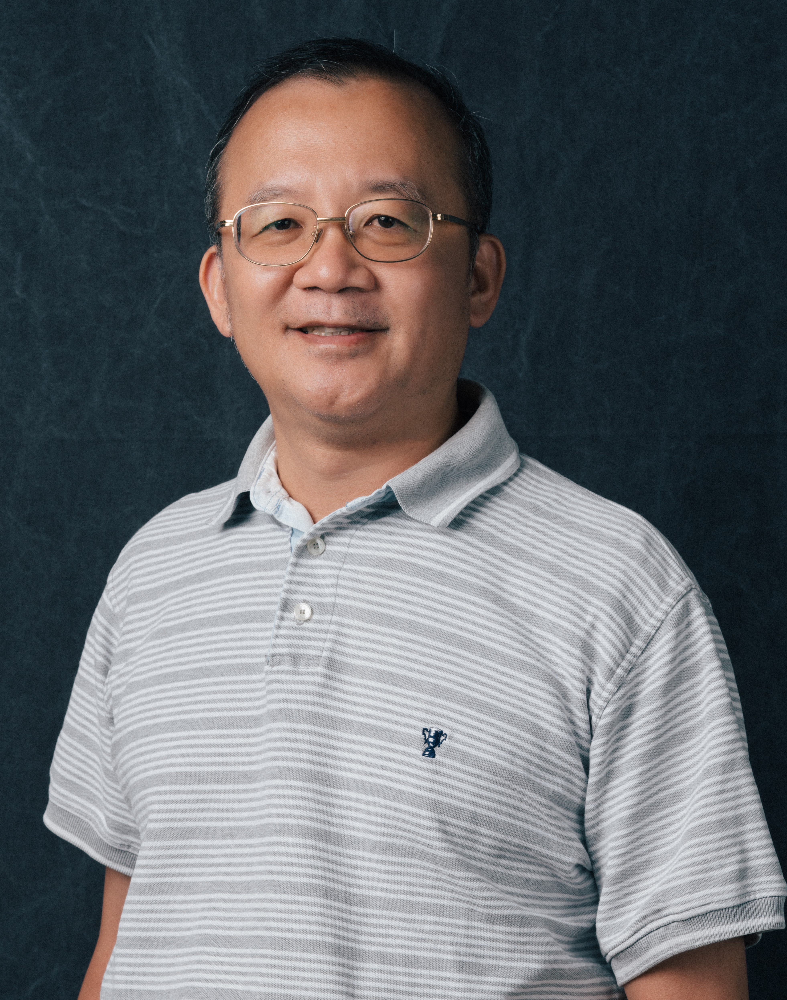

# 吳毅成（[English](.)、中文）

[國立陽明交通大學資訊學院][nctu_cs] 特聘教授、副院長  
[中央研究院資創中心][citi] 合聘研究員  
[日本高知工科大學][kut] 客座教授  
[國際電腦對局學會][icga]副理事長  
<!--[台灣電腦對局學會][tcga]理事長
[中央研究院][sinica][資訊科技創新研究中心][citi] 研究員 & AI專題中心執行長 ([link][myciti])  -->

---

**歡迎加入我們 (包括碩博士生, 研究助理, 博士後研究, 可在交大或中研院). 有興趣者, 請聯絡柯小姐 <cindyko@nycu.edu.tw>.** 

---

### 相關網頁

- [六子棋首頁][connect6]
- 維基百科相關連結︰[吳毅成][icwu_wiki]、[六子棋][connect6_wiki]
- [臉書][icwu_facebook]

---

### [研究][research]

- 含主要研究方向及[成果][achievements]

### [著作][publications]

- 期刊論文、會議論文、專利、研發之系統

### [背景及經驗][about]

- 含教育背景、專業經驗、顧問經驗

### 摘錄榮譽事蹟（[完整][honors]、[新聞報導][news]）
- 2017, 2018, 2021, 2023︰國科會/科技部 未來科技獎. 
- 2022: 在 Las Vegas 舉辦的 [AWS DeepRacer 2022 世界賽][awsfinal2022] 囊括前三名(參賽:~15萬).
- 2021：[109年度科技部傑出研究獎][most-outstanding]
- 2021：[中華民國資訊學會 資訊榮譽獎章][iicm]
- 2020：[AWS DeepRacer 2020 世界賽第1,3名][awsfinal2020]
- 2019：Amazon 在 Las Vegas 舉辦的 [AWS re:Invent 2019 (世界賽) 第 3 名][awsfinal]
- 2019：Amazon 舉辦的 AWS DeepRacer 台灣區第 1, 3名
- 2018︰科技部普適 AI 研究中心 (PAIR) 頒 "AI學術研究獎". 
- 2018︰TAAI 2018 會議之最佳論文獎
- 2017︰CGI 圍棋程式獲得中國野狐網站十段頭銜（繼絕藝、DeepZenGo 後全世界第三個 AI 獲得此頭銜）
- 2017︰培生文教基金會和海峰棋院捐助 660 萬元
- 2017︰在中國內蒙古鄂爾多斯市舉辦的 [2017 中信證券杯首屆世界智能圍棋公開賽競賽](http://www.intergofed.org/igf-news-feed/2017-citic-securities-cup-the-1st-world-ai-go-open.html)，CGI 圍棋程式榮獲亞軍，並於首日預賽全勝，包括擊敗絕藝（騰訊公司所開發）、DeepZenGo，並獲得獎金 10 萬人民幣
- 2017︰在 IEEE FUZZ 2017 圍棋人機賽中，CGI 圍棋程式二戰二勝周俊勳九段（紅面棋王）
- 2017︰圍棋人工智慧與物聯網大會人機配對賽（中韓台）冠軍 
- 2006-2024︰[奧林匹亞電腦賽局競賽][icga]總計獲46面金牌

### [開授課程][courses]

- 目前開授課程：網路程式設計、遊戲對局理論、深度學習與實務
- 過去曾開授課程：資料結構、程式語言、高等 Java 程式設計、演算法、系統程式、平行處理、平行分散程式設計、網際網路／企業內網路

### 實驗室

- [電腦遊戲與智慧實驗室][cgi_lab]
- [實驗室臉書][cgi_lab_fb]

---

### 聯絡資訊

> 電話：035-731855  
> 傳真：035-733777  
> 電子郵件：<icwu@cs.nycu.edu.tw>  
> 地址：台灣新竹市國立陽明交通大學資訊工程系大學路 1001 號

[news]: news.html
[about]: about.html
[honors]: honors.html
[courses]: courses.html
[research]: research.html
[publications]: publications.html
[achievements]: research.html#research-topics-and-achievements
[cgi_lab]: https://cgi-lab.github.io/
[cgi_lab_fb]: https://www.facebook.com/lab.cgi.7
[citi]: https://www.citi.sinica.edu.tw/
[sinica]: https://www.sinica.edu.tw/
[kut]: https://www.kochi-tech.ac.jp/
[nctu]: https://www.nycu.edu.tw/
[nctu_cs]: https://www.cs.nycu.edu.tw/
[connect6]: http://www.connect6.org/
[connect6_wiki]: http://en.wikipedia.org/wiki/Connect6
[icwu_wiki]: http://en.wikipedia.org/wiki/I-Chen_Wu
[icwu_facebook]: https://www.facebook.com/icwu307
[icga]: https://icga.org/
[tcga]: http://tcga.ndhu.edu.tw/
[awsfinal]: https://www.inside.com.tw/article/18289-Taiwan-NCTU-CGI-student-wins-AWS-DeepRacer-League-bronze-medal
[awsfinal2020]: https://aws.amazon.com/tw/blogs/machine-learning/aws-deepracer-league-announces-2020-championship-cup-winner-po-chun-hsu-of-taiwan/
[myciti]: https://www.citi.sinica.edu.tw/pages/icwu/index_zh.html
[iicm]: http://www.iicm.org.tw/about/award.asp
[most-outstanding]: https://www.most.gov.tw/folksonomy/list/554e3625-b1d7-4a0d-9a70-2ffc81c90ab3?l=ch
[awsfinal2022]:https://www.youtube.com/watch?v=T8y-pQ14qGg
