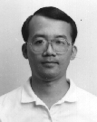

# I-Chen Wu (English, [中文](ch_index.html))

Professor, [Department of Computer Science][nctu_cs], [National Chiao-Tung University][nctu].  
Vice President, [International Computer Games Association (ICGA)][icga].  
President, [Taiwan Computer Games Association (TCGA)][tcga]

---

### Related links

- [Connect6] homepage.
- Pages in Wikipedia: [I-Chen Wu][icwu_wiki] and the game [Connect6][connect6_wiki]
- [My Facebook][icwu_facebook].

---

### [Research]

- Includes my research interests and [achievements].

### [Publications]

- Includes journal papers, conference papers, patent and developed software systems.

### [Background and experiences][about]

- Includes my education background and academic/professional/consulting experiences.

### Selective honors: ([complete][honors])

- 2019: Won the 1st, 3rd, 5th, 7th places in AWS DeepRacer (Taipei) sponsored by Amazon.
- 2018: Received AI Academic Research Award from the PAIR Center of MOST (Ministry of Science and Technology of Taiwan).
- 2018: Received FutureTech Award from MOST.
- 2018: Won the Best Paper Award in the 2018 Conference on Technologies and Applications of Artificial Intelligence (TAAI 2018).
- 2017: CGI was awarded a 10-dan title from Fox Weiqi website.
- 2017: Received NT\$6,600,000 donation from HaiFong Weichi Foundation, Taiwan.
- 2017: Won the second place in ["CITIC Securities Cup", the 1st World AI Go Open](http://www.intergofed.org/igf-news-feed/2017-citic-securities-cup-the-1st-world-ai-go-open.html), held in Ordos, Inner Mongolia, China. Also won all games during the day-1 preliminary, including beating FineArt (developed by Tencent Inc.) and DeepZenGo, and received a prize of RMB\$100,000.
- 2017: Won two games against Chun-Hsun Chou (9p) in IEEE FUZZ 2017 Go competitions. The first Go program developed at academic institutes winning professional 9 dan players in formal competitions.
- 2017: Won six golds (Dark chess, Mahjong, Go 9x9, Go 13x13, Chinese chess, Einstein) and one silver (Go 19x19) and one bronze (Othello) in [the 20th Computer Olympiad][icga].

### [Teaching Courses][courses]

- Include Network Programming, Theory of Computer Games, and Deep Learning and Practice.
- In the past, I have taught Data Structures, Programming Languages, Algorithms, System Programming, Advanced Java Programming, Parallel Processing, Parallel/Distributed Programming, and Internet/Intranet Technologies.

### Laboratory

- [Computer Games and Intelligence Lab][cgi_lab] (abbr. CGI Lab)

---

### Contact Information

> I-Chen Wu, Professor  
> Department of Computer Science  
> National Chiao-Tung University  
> Hsin-Chu, Taiwan

> TEL: +886-3-5731855  
> FAX: +886-3-5733777  
> Email: <icwu@cs.nctu.edu.tw>

[about]: about.html
[honors]: honors.html
[courses]: courses.html
[research]: research.html
[publications]: publications.html
[achievements]: research.html#research-topics-and-achievements
[cgi_lab]: http://www.aigames.nctu.edu.tw/
[nctu]: https://www.nctu.edu.tw/
[nctu_cs]: https://www.cs.nctu.edu.tw/cswebsite/
[connect6]: http://www.connect6.org/
[connect6_wiki]: http://en.wikipedia.org/wiki/Connect6
[icwu_wiki]: http://en.wikipedia.org/wiki/I-Chen_Wu
[icwu_facebook]: https://www.facebook.com/icwu307
[icga]: https://icga.org/
[tcga]: http://tcga.ndhu.edu.tw/
